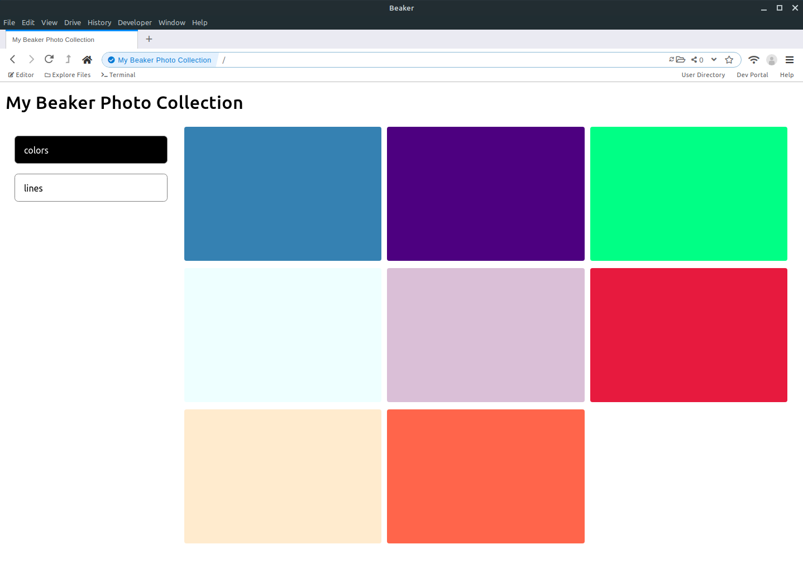

# photo-collection-hyperdrive

A [Beaker](https://beakerbrowser.com/)-powered photo album template



This template allows you to build a photo collection with several albums inside:

```
- src
  - albums
    - some_photos
        face.jpg
    - some_more_photos
        landscape.jpg
```

## Requirements

- Beaker 1.0

## Usage

This site relies on the user adding content to a local folder, which Beaker then syncs to a hyperdrive.

Inside Beaker:
- Create a hyperdrive with folder autosync on, and copy the files under `src` to it.

On your local drive:
- Inside the `albums` folder, add a folder for every album you want to create.
- Add images to the relevant folder.

Back in Beaker:
- Reload the site to verify your new images are displayed!

**Thanks to the folks at Beaker Browser for all the amazing work!**